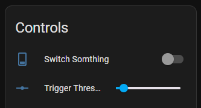

## This ESP Home confit is for David White’s Alarm box interface.

This will show in the Home Assistant:

- 15 Zone with 
  - Zone circuit voltage 
  - Number of triggers in the day 
  - Trigger status
- One relay
- The power of the voltage of the alarm system.

The trigger threshold voltage can be set from within the device’s entity form Home Assistant to cater for different alarm systems.

[alt text](1.png)
[alt text](2.png)
